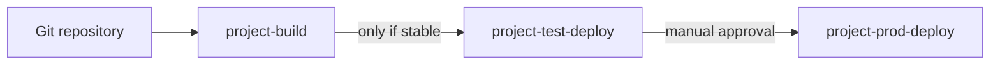
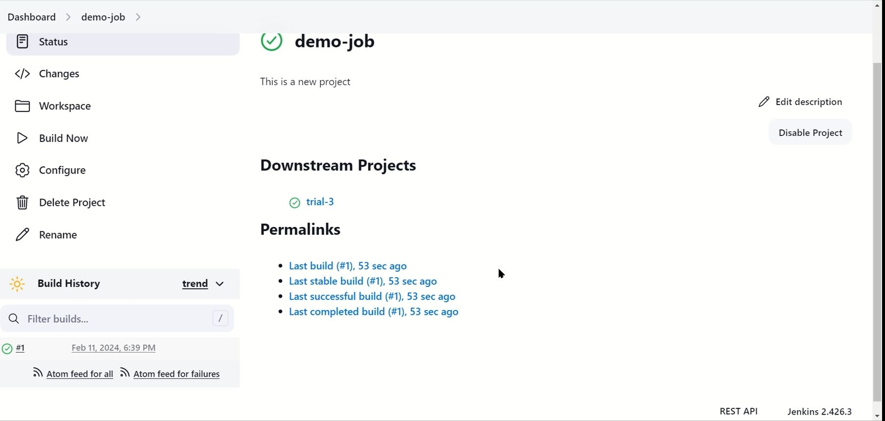
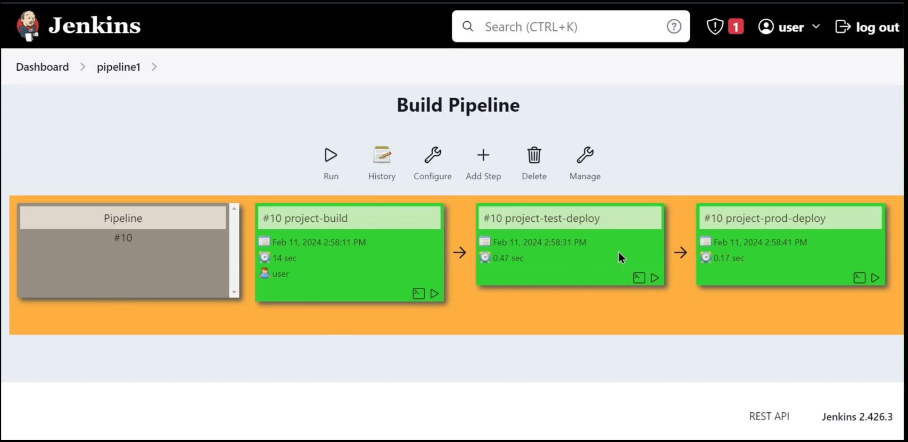
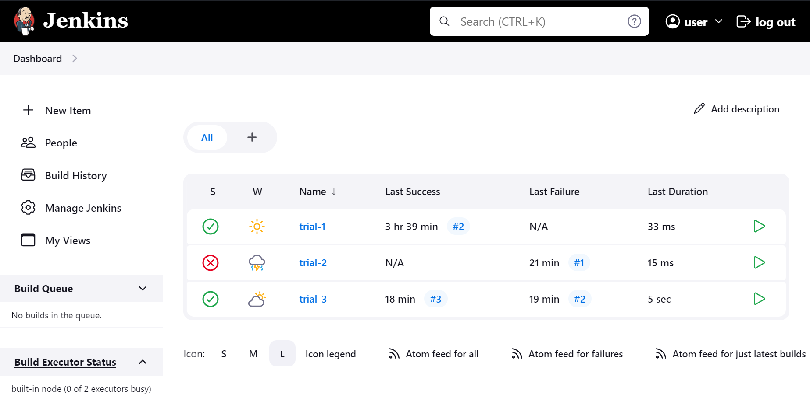

# Jenkins CI/CD Pipeline on AWS

A three-stage Jenkins CI/CD pipeline running on an AWS EC2 instance, built as a group project in February 2024. The pipeline promotes a build through **build → test-deploy → production-deploy**, with stable-build promotion and a manual approval gate before production.

## Pipeline overview

## What we built

- **Jenkins on AWS:** deployed Jenkins (v2.426.3) on an AWS EC2 instance using the Bitnami Jenkins package.
- **Plugin management:** installed and configured plugins, including the Git plugin for source control and the Build Pipeline plugin for visualising runs.
- **Chained jobs:** created three freestyle jobs linked with upstream/downstream triggers ("Build other projects"), set to trigger the next stage only if the previous build is stable.
- **Manual approval gate:** production deployment is triggered manually, demonstrating the difference between continuous delivery (manual release) and continuous deployment (fully automatic).
- **Pipeline view:** tracked each run end to end in a Build Pipeline view, showing the status and duration of every stage.

## Tools

Jenkins · AWS EC2 · Bitnami · Git · Build Pipeline plugin

## Screenshots

| Build pipeline run | Job configuration |
| --- | --- |
|  |  |

## Demo videos

- [Jenkins jobs and builds demo](https://drive.google.com/file/d/1EQ87RVT4vVjUISwxneMLaiE9kg67-or7/view?usp=sharing)
- [Build pipeline demo](https://drive.google.com/file/d/1Plfx1IDvBBxdJGUv2S7YgyW50Cdo87x4/view?usp=sharing)

## Presentation

The slides covering Jenkins concepts, the DevOps lifecycle and our setup are in [Slides.pdf](Slides.pdf)..

## What I learned

- How CI/CD pipelines automate repetitive build and deployment work
- Chaining jobs with upstream/downstream triggers and controlling promotion on build status
- The trade-off between continuous delivery and continuous deployment
- Running and managing an automation server on cloud infrastructure

## Team

- Rhea Yadav
- Aditi Salvi
